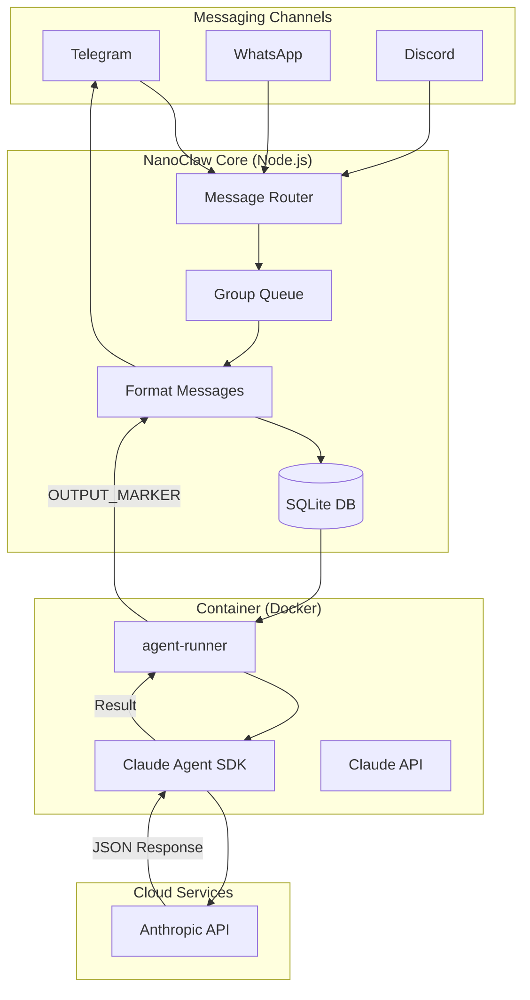
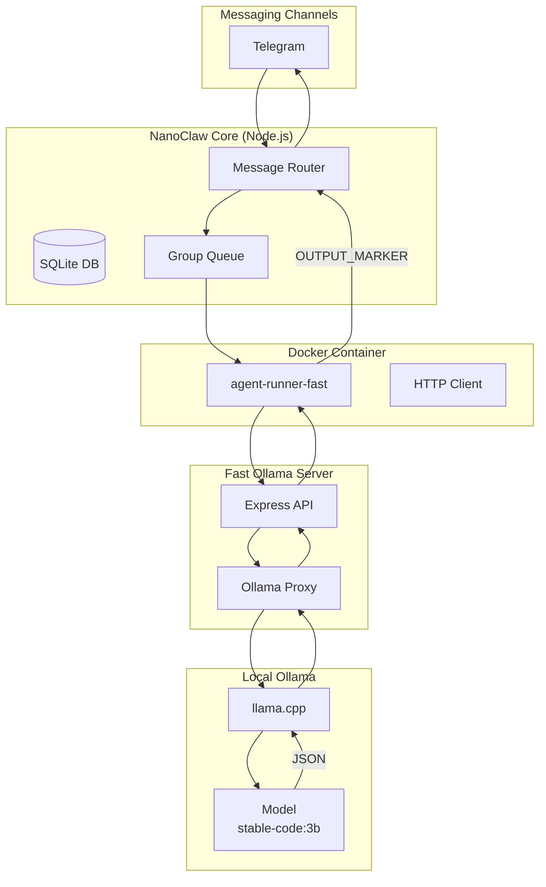

# NanoClaw Architecture - Self-Hosted Edition

## Original NanoClaw Workflow (Cloud AI)



## Self-Hosted NanoClaw Workflow (Local LLM)



## Data Flow Details

### 1. Message Received (Telegram)

```
Telegram Update → Telegram Channel → Router → Queue
```

### 2. Message Processing

```
getNewMessages() → formatMessages() → prompt string
```

### 3. Container Agent Call

```
runContainerAgent(input: ContainerInput) → Docker run → Container runs agent-runner
```

### 4. Agent Runner Execution

```
agent-runner receives JSON via stdin:
{
  "prompt": "User message...",
  "sessionId": "session-123",
  "groupFolder": "Telegram",
  "chatJid": "tg:924669303",
  "isMain": false,
  "assistantName": "@Andy"
}

agent-runner calls local LLM server:
POST /v1/chat/completions
{
  "model": "stable-code:3b-code-q4_0",
  "messages": [
    {"role": "system", "content": "You are Andy, a helpful AI assistant."},
    {"role": "user", "content": "User message..."}
  ],
  "max_tokens": 512
}

agent-runner outputs result:
---NANOCLAW_OUTPUT_START---
{"status":"success","result":"Hello! How can I help?","newSessionId":"session-456"}
---NANOCLAW_OUTPUT_END---
```

### 5. Response Sent

```
ContainerOutput → channel.sendMessage() → Telegram
```

## Key Differences: Original vs Self-Hosted

| Component       | Original                | Self-Hosted                  |
| --------------- | ----------------------- | ---------------------------- |
| Container Image | `nanoclaw-agent:latest` | `nanoclaw-agent-fast:latest` |
| LLM Endpoint    | `api.anthropic.com`     | `http://localhost:8080`      |
| API Format      | Anthropic Messages API  | OpenAI Chat Completions      |
| Model           | Claude Sonnet 4         | stable-code:3b               |
| Authentication  | API Key                 | None (localhost)             |

## Output Format

The container MUST output results with these markers:

```
---NANOCLAW_OUTPUT_START---
{"status":"success","result":"Response text","newSessionId":"session-123"}
---NANOCLAW_OUTPUT_END---
```

## API Endpoint

The fast server must accept:

```
POST /v1/chat/completions
```

Request:

```json
{
  "model": "stable-code:3b-code-q4_0",
  "messages": [
    { "role": "system", "content": "You are Andy..." },
    { "role": "user", "content": "User message" }
  ],
  "temperature": 0.7,
  "max_tokens": 512
}
```

Response:

```json
{
  "choices": [
    {
      "message": {
        "role": "assistant",
        "content": "Response text"
      }
    }
  ]
}
```

## Files Involved

| File                                              | Purpose                  |
| ------------------------------------------------- | ------------------------ |
| `src/index.ts`                                    | Main orchestrator        |
| `src/container-runner.ts`                         | Spawns Docker containers |
| `src/router.ts`                                   | Message formatting       |
| `src/db.ts`                                       | SQLite operations        |
| `container/agent-runner-fast/src/index.ts`        | Agent runner             |
| `container/fast-ollama-server/server-windows.cjs` | Local LLM proxy          |

## Troubleshooting Steps

1. **Check messages arriving** - Telegram channel receives message
2. **Check prompt formatting** - Messages formatted correctly
3. **Check container spawn** - Docker container starts
4. **Check server reachability** - Container can reach fast server
5. **Check API response** - Server returns valid JSON
6. **Check output parsing** - OUTPUT_MARKERs present

See [DEBUG_CHECKLIST.md](DEBUG_CHECKLIST.md) for detailed debugging.
